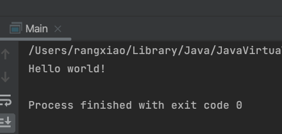

# AP CSA

- [组成这个世界的基本元素](#ch_1)
    - [什么叫程序](#ch_1.1)
    - [逻辑运算](#ch_1.2)
- [数据与数据类型](#ch_1)
    - [什么是数据与数据类型](#ch_2.1)
    - [Primitive type](#ch_2.2)
    - [Class -- 类](#ch_2.3)
    - [variable -- 变量](#ch_2.4)
- [Java中的逻辑判断与循环](#ch_3)
    - [if条件语句](#ch_3.1)
    - [for loop -- for循环](#ch_3.2)
    - [while loop -- while循环](#ch_3.3)
    - [break -- 中断 与 continue -- 继续](#ch_3.4)
    - [switch condition](#ch_3.5)
- [Class -- 类](#ch_4)
    - [Class与Class的组成](#ch_4.1)
    - [Class的调用](#ch_4.2)


# 安装IDE

google搜索IntelliJ,下载并安装 community版本

# <a id="ch_1">组成这个世界的基本元素</a>

在物理层面上，程序的世界是由电讯号组成的。电讯号的高低位（电压高低）代表**逻辑上的是与非（1 和0）**，电子芯片通过传递运算，就展示出了你看到的这个世界。。。

这其中的步骤包含了大量的知识，而我们应该先从认识什么叫程序开始

## <a id="ch_1.1">什么叫程序</a>

广义上讲，从一个我们在电脑端使用的程序（Application）到一段只能简单执行x+y运算的代码都可以叫做程序

在Computer Science中我们有一些更加明确的称呼，（在 AP CSA中我们使用Java作为程序语言，以下称呼都与Java相关，在不同的编程语言中，我们可能使用不同称呼描述相同的概念）

以最原始的，最经典的HelloWorld为例：

```java
public static void main(String[] args) {
        System.out.println("Hello world!");
    }
```

我们先看这么一小段代码中都涉及到了那些基础称呼：

<a id="dic_method">**Method**</a>：一段由能够完成特定目标的代码，执行顺序从上到下，一个Method可以调用（Call）其他Method或者他自身，一个Method一定会结束

<a id="dic_method">**Parameter**</a>：参数，只在Method的构建过程中所使用的预期参数，并非实际使用的参数，每一个参数都要包含这个参数的数据类型（Data Type），在Java中我们使用Class 的名称（Naming）作为数据类型，同时也可以使用Primative type作为数据类型

<a id="dic_method">**Return Type**</a>: 该Method返回的值的类型

<a id="dic_method">**Accessibility**</a>: 成员访问权限，可以简单理解为谁能看到，谁能使用

**Method Name**：这个Method的名称，同时也包括的调用（call）规则

**Binding**: 这个Method如何被使用，分为static与dynamic两种，我们目前大多是时候都是用的是dynamic binding，动态绑定，具体实现是由地址内存决定的，属于专业级别通识课

### 运行代码

我们目前写出来的代码想要运行起来，还不能像手机或者电脑上的app那么简单，首先我们的代码依存于一个环境，只有在特定的环境中才能运行起来，这就是为什么我们通过IDE来学习

在IDE中运行代码：



简单来说这就是这段代码的运行结果了，但是实际上像这种能够显示出来的代码并不是我们进行程序设计是的大多数，大部分的时间，我们都是在对数据（Data）的运行设计运行规则。

想要学习如何设计规则，我们要先了解计算机世界的基本运行逻辑

## <a id="ch_1.2">逻辑运算</a>

在计算机的世界中，物理层面上，使用的都是逻辑运算，通过逻辑运算得出计算结果，这也是为什么数据最终都是0和1

在二元世界中的逻辑判断逻辑分为以下几种

与 （AND &）

```jsx
1 & 1 = 1
1 & 0 = 0
0 & 0 = 0
```

或 （OR |）

```jsx
1 | 1 = 1
1 | 0 = 1
0 | 0 = 0
```

非 （NOT ！）

```jsx
!1 = 0
!0 = 1
```

每一个逻辑字符的大小为 1bit，8 bit = 1 byte

# <a id="ch_2">数据与数据类型</a>

## <a id="ch_2.1">什么是数据与数据类型</a>

计算机中的一切都可以被视作数据，计算机通过对数据进行提取，运算，储存，与展示帮助我们进行计算

计算机如何将01变成我们看到的一切？

计算机通过识别不同的数据类型，对不同类型的数据进行不同的操作，比如，对于数字类型的数据就可以进行加减乘除，对于文字类的数据就可以进行增删改查，图片与视频也是通过对于颜色的变化而实现的，而颜色则是通过不同颜色的编码规则定义。

在Java中，最原始的数据类型被称作Primitive type

## <a id="ch2.2">Primitive type</a>

在Java中，程序语言预先设定好的最基础的数据格式被称之为Primitive Datatype，分别是：

- <font color=Red>int （整数 4byte）</font>
- short（整数 2byte）
- long（整数 8 byte）
- string （字符串）
- float （浮点数、小数 4byte）
- <font color=Red>double （浮点数、小数 8byte）</font>
- <font color=red>boolean （逻辑字符）</font>
- char（字符）
- byte（字节）

### <a id="dic_bit2hex">bit to decimal to hex</a>

bit表示二进制，只由0和1构成

decimal 表示十进制，由0~9构成

hex 表示16进制，由0~F构成

| Decimal | Bit | Hex |
| --- | --- | --- |
| 0 | 0 | 0 |
| 1 | 1 | 1 |
| 2 | 10 | 2 |
| 3 | 11 | 3 |
| 4 | 100 | 4 |
| 5 | 101 | 5 |
| 6 | 110 | 6 |
| 7 | 111 | 7 |
| 8 | 1000 | 8 |
| 9 | 1001 | 9 |
| 10 | 1010 | a |
| 11 | 1011 | b |
| 12 | 1100 | c |
| 13 | 1101 | d |
| 14 | 1110 | e |
| 15 | 1111 | f |

## <a id="ch_2.3">Class —— 类</a>
Class是Java的核心。在Java中，各种概念都被抽象成为Class，这些概念包括实体和过程，关于Class的所有有效操作都会被在Class内部中定义,相关的数据定义也会储存在Class的定义中，当我们创建一个实体的时候，相关的数据就会被储存在所创建的实体中。关于Class的更多内容会在下一个章节中进行讲解。目前，我们需要知道的是类似于Primitive Type，类的名称也可以作为变量的数据类型。后面在第四个章节<a href="#ch_4">Class -- 类</a>中，我们会更加深入学习关于Class的内容。

## <a id="ch_2.4">variable — 变量</a>

如同我们在数学中使用的一样，在计算机中，我们通过声明来创建一个新的变量，同时可以对对变量进行赋值以及使用

```java
int a = 0;
int b = 1;
int c = a+b;
System.out.println(c);
```

在这段代码中，我们声明了三个新的variable a、b、c，并同时赋予他们各自的值。

同时他们就像是计算器一样，能够对值进行操作，通过不同的方法，可以通过命令让计算机帮助我们进行计算。计算的结果是多种多样的，并不仅限于数字上的计算，像是我们看到的视频，听到的声音，使用的功能，都是计算的结果。

### 声明一个新的Primitive type的变量

```java
int a;
int b,c,d;
char chr;
```

在变量声明的时候，我们需要指明变量的数据类型（datatype），就像我们之前说过的，这里也可以使用Class的名称作为数据类型的声明，在下一个章节中我们将会学习如何创建并使用一个Class。

### 对变量进行操作

```java
a = 10;
b = 100;
c = 1 + a;
d = c * b;
```

对于已经声明的变量，在使用过程中，不再需要说明他的数据类型。但是需要保证计算过程是符合规范的。在这里我们对相同的int类型进行数学操作，加法，减法等其他的数学逻辑也都有相对应<a id="dic_operator">操作符（Operator）</a>

| 操作符 | 含义 |
| --- | --- |
| + | 加法 |
| - | 减法 |
| * | 乘法 |
| / | 除法 |
| % | 求余运算 |
| = | 赋值，将右侧的运算结果赋值给左侧的变量中 |

在数学运算之外，我们还可以进行使用逻辑上的比较

| 逻辑操作符 | 含义 |
| --- | --- |
| == | 相等/相同 |
| > | 大于 |
| ≥ | 大于或等于 |
| < | 小于 |
| ≤ | 小于或等于 |
| ！= | 不等于 |

逻辑比较的结果为`boolean`类型，值为`True`或者`False`，并通过逻辑运算相连接。在这里的逻辑运算所使用的符号与之前bit操作符之间略有不同，更多的，我们使用的是这一种

| && | And |
| --- | --- |
| \|\| | Or |
| ! | Not |

运算的逻辑与之前相同

<aside>
💡 练习:
声明两个新的整数类型的变量 int a和 int b，并分别给他们赋值12和349。
比较a与b的大小，并将比较的结果储存在一个 boolean 类型的变量c中。

</aside>

### <a id="dic_output">输出</a>
到目前为止我们已经学习过了Java中最基础的数学运算方法，但是我们还不能直观的看到我们的计算结果。为了能够看到我们的输出结果，或者是帮助我们直观的了解到程序运行的位置，我们可以使用Java内置的方法对数字，字符串等内容在我们的的command line进行输出。
```java
System.out.println("需要输出的能容");
System.out.print("需要输出的内容");
```
我们现在来分析一下两段代码。
如同我们之前说过的一样，任何一个方法调用（Call）都是通过使用方法的名称完成的。这里面被调用的方法分别为`println`和`print`。这里就表明了他们是两个不同的方法，有着不同的作用。
`println`的作用是在命令行中进行输出，并在输出结束后将命令行的光标移至下一行
`print`的作用则是在命令行中输出，但是并不会新起一行，所以接下来打印的东西就会继续当前行
括号里面包含着的内容叫做参数，这里这两个方法需要的参数的数据类型都是字符串，或者数字。在上面的调用中我们的输出属于字符串类型，在Java中，我们用英文符号中的双引号作为字符串的标志，所有被双引号包裹起来的内容都是字符串格式。我们也可以把一个字符串赋值给他对应类型的变量中，如：
```java
String str = "这是一条字符串";
```
    
    动手实验
    先预测以下代买会输出什么结果，然后在IntelliJ中分别输入一下内容查看输出的格式，并尝试解释为什么输出是当前格式
```java
//A
System.out.print("A");
System.out.println("B");
System.out.print("C");

//B
System.out.println("A");
System.out.print("B");
System.out.println("C");


//C
System.out.print("A");
System.out.println("B");
System.out.println("C");
System.out.print("D");

```
# <a id="ch_3">Java中的逻辑判断与循环</a>
在编写程序的时候，为了达到更加复杂的目的，我们所需要计算机来帮助我们做的不仅仅是数学上的计算，或者是简单的输出一些文字。 
我们还需要更多的不同结构来帮助我们执行更加负载的步骤。
## <a id="ch_3.1">if条件语句</a>
我们现在已经知道，在计算机中，除了数字上的计算，逻辑上的判断与比较也是我们经常使用的手段之一。
在很多情况下，我们都希望通过判断某个事实的真假来让我们的代码执行不同的部分。
在Java中，我们所使用的方法为`if`条件句。
举一个最简单的例子，如果我们想要判断一个整数a是否为正整数，我们可以使用如下代码
```java
public boolean positive(int a) {
    if(a>=0){
        return true;
    } else {
        return false;
    }
}
```
在这里我们使用的语法结构就是`if`语句。`if`语句由`if`开始，在括号中包含需要检测的逻辑，这里的结果必须是逻辑判断的结果，并且在同时需要满足多个条件时，可以使用逻辑运算<a href="#dic_operator">操作符</a>中的and, or, not来连接。在面对复杂的条件组合时，不同的排列方式会导致不同的结果，需要多加注意。
`if`结构中，大括号所包含的内容是按条件运行的代码，当括号中所包含的逻辑条件为真时，大括号内所包括的内容才会被执行，执行完成后，继续运行大括号外的内容。
当然，当我们需要两种或更多的情况的话，我们也可以使用`else`或`else if`来囊括更多不同的运行内容。`else`表示所有其他结果，`else if`则和`if`一样，可以设定更多的条件。
这里需要注意的是，`if`条件语句中，只要有一个部分被执行了，其他的内容也不再会被检测。所以，当我们有多条件的时候，考虑判断他们时的先后顺序则更加重要。
在实际操作中，我们很少会为了这么简单直接的逻辑而浪费这么多行代码的。
我们来看一个更加有实际意义的例子吧。
一个简单的奇偶判断程序：从输入端取得一个`int`类型的数字输入，如果该数字是奇数，在命令行输出Odd；如果该数字是偶数，在命令行输出even。
```java
public void evenOrOdd(int i){
    if(i%2 == 0){
        System.out.println("Even");
    } else {
        System.out.println("Odd");
    }
}
```
    注意！
    在这段代码中，我们使用了`void`作为我们的返回类型。再看我们的代码会发现，我们只是执行了某个过程，而没有返回一个结果。
    在Java中，这种类型的返回，或者说是没有返回是被允许的，此时返回类型被称作虚类型void。
    当此类Method被调用的时候，它依旧会按照从上之下的顺序逐行运行，直到没有可以运行的部分之后，就会返回到调用它的Method中继续运行。
在代码的世界中，总是可以有一些不一样的解法，如果我们稍微尝试一点新的东西：
```java
public void evenOrOdd(int i){
    System.out.println(i % 2 == 0 ? "Even" : "Odd" );
}
```
这里看起来可能有点陌生，我们可以仔细看一下:
`i % 2`这里是我们需要判断的条件，就如同`if`条件语句中括号内包裹的部分，然后用一个`?`连接，问号左侧是条件，右侧是结果。
然后两个需要打印的结果用`:`连接，冒号左侧是是当条件为真时此段代码输出的结果，右则是当结果为假时输出的结果。
最后按照我们先运行括号内的内容的原则，打印的内容将会是条件判断输出的结果，即输入则整数是偶数还是奇数。
这个就是Java中的<a id="dic_ternaryOperator">Tenary operator</a>
<aside>

    💡 练习:
    完成一个method，这个method使用两个数字类型，判断并输出以下情形：
    1. 第一个数比第二个数大
    2. 第一个数和第二个数一样大
    3. 第一个数比第二个数小
</aside>

## <a id="ch_3.2">for loop -- For循环</a>
在使用计算机帮我进行计算的时候，还有另外一种情形非常的常见：对类似的目标进行相同的操作。比如说对一个数字进行进行n次加法，每一次相加的值为当前的n
如果我们使用数字10为例
10+1=11
11+2=13
13+3=16
16+4=20
···

对于这一类的操作，在计算机中我们可以使用`for`循环
```java
int a = 10;
int n = 10;
for(int = 1; i <= n; i++){
    a += i;  //这里与 a=a+1相同，同理也可以使用 -= 等
    System.out.println(a);
}
System.out.println(a);
```
类似于`if`条件语句，`for`循环的判断条件也在括号中，一共分为三个部分，用`;`做分隔。在第一部分中，创建一个循环计数器，计数器的初始数值可以按照需求设置。第二部分中，我们将计数器某个条件比较判断，当条件满足时，运行大括号内的代码。第三部分作为计数器的增长，当每一次循环结束时，计数器会按照这里的指令更新。`++`是`+=1`的简单写法，当然我们也可以让它变成+2，*3，或者各种不同的变化方式。

这里只是最基础的`for`循环，还有另外一种形式的`for`循环也大量的使用在Java中。我们会在后面学习了数据结构后再学习另外一种形式的`for`循环。

不要忘记这些语句都可以互相嵌套，我们可以再`for`循环中添加`if`条件语句作为一种过滤条件，以对某些特定的数据进行不同操作。
<aside>

    💡 练习:
    打印1~50，并且只在双数之后换行

</aside>

## <a id="ch_3.3">while loop -- while循环</a>
类似于`for`循环，我们也可以使用一种类似无限循环的方式快速的建立另外一种循环逻辑：`while`循环。
```java
int a = 0;
while(a < 10) {
    System.out.println(a);
    a++;
}
```

`while`循环会在每一次循环的开始检测一次括号中的内容是否为真，如果为真，就会执行。它更像是`for`循环和`if`条件的结合。

这个时候我们来思考一下我们日常使用的程序是如何运行的，我们可以把它们简单的理解为一个直接的`while(true){...}`形式。通过这样的方法让程序不停地执行下去，直到用户退出应用。

## <a id="ch_3.4">break -- 中断 与 continue -- 继续</a>
对于循环，我们当然需要能力去强行终止，或者是直接进入到下一循环。在Java中，这两个功能是通过`break`与`continue`实现的。
我们可以使用`break`去终止一个循环，终止的结果就是直接完成循环，继续运行循环之后的内容。 
我们也可以使用`continue`去跳过当前循环直接进入下一个循环。
这两者也有一个最简单的区别，`break`之后的内容是loop之外的，`continue`之后的内容是loop之内的。
```java
int i = 0;
while(i < 10){
    if(i == 5) break;
    System.out.println(i);
}

for(int j = 0; j < 10 ; j++){
    if(i == 5) continue;
    System.out.println(i);
}

```
使用`break`和`continue`我们就能对代码在loop中的运行有更多的控制。

## <a id="ch_3.5">switch condition</a>
类似于if condition，在多个情况并列的情况下我们可以使用switch进行多种情况的跳转。
```java
public void demo(int a){
    switch(a){
        case 1:
            System.out.println("case 1");
            break;
        case 2:
            System.out.println("case 2");
            break;
        case 20:
            System.out.println("case 3");
            break;
    }
}
```
在switch中，condition被限制为一个variable，并且需要为primitive type。
通过使用break，我们在一种情况结束时结束condition的判断。
现在尝试删除一些break，看一眼输出结果和你的预期是否有区别，为什么？

# <a id="ch_4">Class -- 类</a>
## <a id="ch_4.1">Class与Class的组成</a>
在Object Oriented Pgramming（面向对象编程）的过程中，Class是最基本的概念元素。在Java中，Class可以作为实体、概念、或过程的抽象化表示。比如，在程序中，我们想要用数据及其相关处理办法表示某一种事实上存在某个物体的概念，如学生。那么首先我们需要考虑的是是否需要某些与实体相关的数据需要被储存，如学生号，年级，姓名等，然后就是根据需要面对与学生可能会进行的动作进行定义，最后我们需要一个最基本的方法来创建一个新的学生实体（instance）。这些东西全部集合在一起就组成了一个类的基础结构。

现在我们用刚刚的学生来举例，如果我们现在想要创建一个学生的Class， 其中需要储存学生的姓名，学号，年级，性别这四种信息。对于学生，我们需要能够更改相关的信息。以下就是我们如何创建一个学生：
```java
public class Student {
    // field to define data type and variable name to store related data
    public int stuID;
    public String lastName;
    public String firsName;
    public int grade;
    public String gender;
    
    // constructor
    public Student(String lastName, String firstName){
        this.firsName = firstName;
        this.lastName = lastName;
    }
    
    // Methods
    public void setStuID(int stuID){
        this.stuID = stuID;
    }
    public void setGrade(int grade){
        this.grade = grade;
    }
    public void setGender(String gender){
        this.gender = gender;
    }
}
```

### <a>Class Attributes</a>
在Java中，与当前类相关的数据及其他类都被储存在Class Attributes（field）中。 在上面的例子中，与学生相关的信息所在的位置就是这个学生类的Attributes。
需要注意的是，在Attributes中，我们可以只声明，不赋值。这里声明的量可以被视作整个class中的全局变量，当然，这个全局变量，并非真正的全局变量，Global value。在整个Class中的任意位置都可以对Attributes进行调用。虽然我们不允许使用相同名称的变量（variable），但是我们可以在method中使用与attributes命名相同的parameter，因此有时需要使用`this`来表明调用值为Attributes中的变量，而非Parameter。
### <a>Constructor</a>
仔细看我们的代码，会发现我们有一个没有return type的Method。这部分为Constructor。Constructor可以用来创建一个当前这个类的实体（instance）。我们需要分清class与instance之间的区别。class可以视作一种属性，代表了这个物品的数据和它能够调用的方法。而instance则是在运行后被创建的实体，它会在计算机的储存空间中占用一定的内存。通常我们会给实体一个名字，就是variable name。关于constructor的使用，我们会在下面class的调用中讲到。
### <a>Method(s)</a>
在一个class之内，我们我可定义很多与这个class相关的method。
既我们之前在学习的内容。
## <a id="ch_4.2">Class的调用</a>
我们可以使用已定义的class来创建一个新的实体。如同我们之前variable赋值过程一样，只不过，对于任何一个非primative type的类型，我们需要使用`new`关键词。
例如：
```java
Student s1 = new Student("tim", "tom");
```
这里我们如同使用其他method一样，对constructor进行调用，并且传入所需的parameter。
成功创建一个实例之后，我们就可以使用这个实例所属的class中所含有的method。通过这些method，我们对当前实例进行更改，运算。
```java
s1.setStuId(123456);
s1.setGrade(11);
s1.setGender("M");
```
同时，如果class定义中的attributes为public类型，我们也可以直接进行访问，调用，更改。
```java
System.out.println(s1.stuId);
s1.grade=12;
System.out.println(grade);
```
因为pulibc类型的attributes可以被任意访问，而我们多数时候不希望使用者可以随意更改这些数值，所以大多数时候，我们都会将attributes设置为private，然后通过get&set methods去进行调用及更改。

除了我们自己定义的class外，java自身也有许多的library供我们使用。
我们最常见的就是ArrayList了，这个class是java提供给我们，已创建一个list。
我们也会随着使用，逐渐加深对ArrayList的理解。
```java
ArrayList<Student> list = new ArrayList();
list.add(s1) 
```

对于调用的class，我们并不需要知道他们内部是如何定义运行的，我们只需要知道它会按照它的描述去运行即可。这也是编程中一个重要的概念，abstract。
现在我们已经算是掌握了最基础的知识，我们接下来会练习不同的内容，以加强掌握。
在使用class的时候，也需要思考，当前我们已知的class的使用方法是否有不方便的地方？
